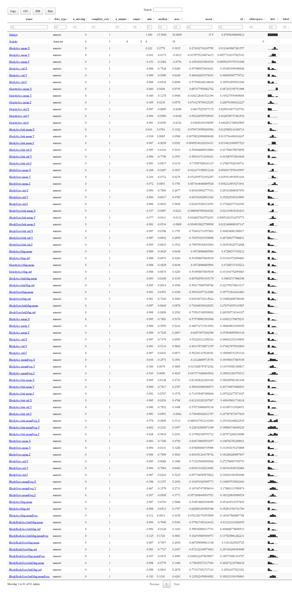

Codebook for UCI HAR Dataset
================
Carlos Sanchez
2/Jan/2021

# Human Activity Recognition Using Smartphones Data Set

    ## No missing values.

### Metadata

#### Description

**Dataset name**: tidy\_dataset

The dataset has N=180 rows and 81 columns. 180 rows have no missing
values on any column.

<details>

<summary title="Expand this section to see some additional metadata in a structured format that is useful for search engines">Metadata
for search engines</summary>

  - **Date published**: 2021-01-02

<table class="kable_wrapper">

<tbody>

<tr>

<td>

| x                             |
| :---------------------------- |
| Subject                       |
| Activity                      |
| tBodyAcc.mean.X               |
| tBodyAcc.mean.Y               |
| tBodyAcc.mean.Z               |
| tBodyAcc.std.X                |
| tBodyAcc.std.Y                |
| tBodyAcc.std.Z                |
| tGravityAcc.mean.X            |
| tGravityAcc.mean.Y            |
| tGravityAcc.mean.Z            |
| tGravityAcc.std.X             |
| tGravityAcc.std.Y             |
| tGravityAcc.std.Z             |
| tBodyAccJerk.mean.X           |
| tBodyAccJerk.mean.Y           |
| tBodyAccJerk.mean.Z           |
| tBodyAccJerk.std.X            |
| tBodyAccJerk.std.Y            |
| tBodyAccJerk.std.Z            |
| tBodyGyro.mean.X              |
| tBodyGyro.mean.Y              |
| tBodyGyro.mean.Z              |
| tBodyGyro.std.X               |
| tBodyGyro.std.Y               |
| tBodyGyro.std.Z               |
| tBodyGyroJerk.mean.X          |
| tBodyGyroJerk.mean.Y          |
| tBodyGyroJerk.mean.Z          |
| tBodyGyroJerk.std.X           |
| tBodyGyroJerk.std.Y           |
| tBodyGyroJerk.std.Z           |
| tBodyAccMag.mean              |
| tBodyAccMag.std               |
| tGravityAccMag.mean           |
| tGravityAccMag.std            |
| tBodyAccJerkMag.mean          |
| tBodyAccJerkMag.std           |
| tBodyGyroMag.mean             |
| tBodyGyroMag.std              |
| tBodyGyroJerkMag.mean         |
| tBodyGyroJerkMag.std          |
| fBodyAcc.mean.X               |
| fBodyAcc.mean.Y               |
| fBodyAcc.mean.Z               |
| fBodyAcc.std.X                |
| fBodyAcc.std.Y                |
| fBodyAcc.std.Z                |
| fBodyAcc.meanFreq.X           |
| fBodyAcc.meanFreq.Y           |
| fBodyAcc.meanFreq.Z           |
| fBodyAccJerk.mean.X           |
| fBodyAccJerk.mean.Y           |
| fBodyAccJerk.mean.Z           |
| fBodyAccJerk.std.X            |
| fBodyAccJerk.std.Y            |
| fBodyAccJerk.std.Z            |
| fBodyAccJerk.meanFreq.X       |
| fBodyAccJerk.meanFreq.Y       |
| fBodyAccJerk.meanFreq.Z       |
| fBodyGyro.mean.X              |
| fBodyGyro.mean.Y              |
| fBodyGyro.mean.Z              |
| fBodyGyro.std.X               |
| fBodyGyro.std.Y               |
| fBodyGyro.std.Z               |
| fBodyGyro.meanFreq.X          |
| fBodyGyro.meanFreq.Y          |
| fBodyGyro.meanFreq.Z          |
| fBodyAccMag.mean              |
| fBodyAccMag.std               |
| fBodyAccMag.meanFreq          |
| fBodyBodyAccJerkMag.mean      |
| fBodyBodyAccJerkMag.std       |
| fBodyBodyAccJerkMag.meanFreq  |
| fBodyBodyGyroMag.mean         |
| fBodyBodyGyroMag.std          |
| fBodyBodyGyroMag.meanFreq     |
| fBodyBodyGyroJerkMag.mean     |
| fBodyBodyGyroJerkMag.std      |
| fBodyBodyGyroJerkMag.meanFreq |

</td>

</tr>

</tbody>

</table>

</details>

\#Variables

### Subject

#### Distribution


0 missing values.

#### Summary statistics

| name    | data\_type | n\_missing | complete\_rate | min | median | max | mean |       sd | hist                                               | label |
| :------ | :--------- | ---------: | -------------: | :-- | :----- | :-- | ---: | -------: | :------------------------------------------------- | :---- |
| Subject | numeric    |          0 |              1 | 1   | 16     | 30  | 15.5 | 8.679585 | \<U+2587\>\<U+2587\>\<U+2587\>\<U+2587\>\<U+2587\> | NA    |

### Activity

#### Distribution


0 missing values.

#### Summary statistics

| name     | data\_type | n\_missing | complete\_rate | n\_unique | empty | min | max | whitespace | label |
| :------- | :--------- | ---------: | -------------: | --------: | ----: | :-- | :-- | ---------: | :---- |
| Activity | character  |          0 |              1 |         6 |     0 | 6   | 18  |          0 | NA    |

### tBodyAcc.mean.X

#### Distribution


0 missing values.

#### Summary statistics

| name            | data\_type | n\_missing | complete\_rate | min  | median | max |      mean |        sd | hist                                               | label |
| :-------------- | :--------- | ---------: | -------------: | :--- | :----- | :-- | --------: | --------: | :------------------------------------------------- | :---- |
| tBodyAcc.mean.X | numeric    |          0 |              1 | 0.22 | 0.28   | 0.3 | 0.2743027 | 0.0121646 | \<U+2581\>\<U+2581\>\<U+2582\>\<U+2587\>\<U+2582\> | NA    |

### tBodyAcc.mean.Y

#### Distribution


0 missing values.

#### Summary statistics

| name            | data\_type | n\_missing | complete\_rate | min     | median  | max      |        mean |        sd | hist                                               | label |
| :-------------- | :--------- | ---------: | -------------: | :------ | :------ | :------- | ----------: | --------: | :------------------------------------------------- | :---- |
| tBodyAcc.mean.Y | numeric    |          0 |              1 | \-0.041 | \-0.017 | \-0.0013 | \-0.0178755 | 0.0057712 | \<U+2581\>\<U+2582\>\<U+2587\>\<U+2587\>\<U+2581\> | NA    |

### tBodyAcc.mean.Z

#### Distribution


0 missing values.

#### Summary statistics

| name            | data\_type | n\_missing | complete\_rate | min    | median | max     |        mean |       sd | hist                                               | label |
| :-------------- | :--------- | ---------: | -------------: | :----- | :----- | :------ | ----------: | -------: | :------------------------------------------------- | :---- |
| tBodyAcc.mean.Z | numeric    |          0 |              1 | \-0.15 | \-0.11 | \-0.075 | \-0.1091638 | 0.009582 | \<U+2581\>\<U+2581\>\<U+2587\>\<U+2585\>\<U+2581\> | NA    |

### tBodyAcc.std.X

#### Distribution


0 missing values.

#### Summary statistics

| name           | data\_type | n\_missing | complete\_rate | min | median | max  |        mean |        sd | hist                                               | label |
| :------------- | :--------- | ---------: | -------------: | :-- | :----- | :--- | ----------: | --------: | :------------------------------------------------- | :---- |
| tBodyAcc.std.X | numeric    |          0 |              1 | \-1 | \-0.75 | 0.63 | \-0.5576901 | 0.4516911 | \<U+2587\>\<U+2582\>\<U+2585\>\<U+2582\>\<U+2581\> | NA    |

### tBodyAcc.std.Y

#### Distribution


0 missing values.

#### Summary statistics

| name           | data\_type | n\_missing | complete\_rate | min    | median | max  |        mean |       sd | hist                                               | label |
| :------------- | :--------- | ---------: | -------------: | :----- | :----- | :--- | ----------: | -------: | :------------------------------------------------- | :---- |
| tBodyAcc.std.Y | numeric    |          0 |              1 | \-0.99 | \-0.51 | 0.62 | \-0.4604626 | 0.496565 | \<U+2587\>\<U+2581\>\<U+2585\>\<U+2583\>\<U+2581\> | NA    |

### tBodyAcc.std.Z

#### Distribution


0 missing values.

#### Summary statistics

| name           | data\_type | n\_missing | complete\_rate | min    | median | max  |        mean |        sd | hist                                               | label |
| :------------- | :--------- | ---------: | -------------: | :----- | :----- | :--- | ----------: | --------: | :------------------------------------------------- | :---- |
| tBodyAcc.std.Z | numeric    |          0 |              1 | \-0.99 | \-0.65 | 0.61 | \-0.5755602 | 0.3955439 | \<U+2587\>\<U+2582\>\<U+2585\>\<U+2581\>\<U+2581\> | NA    |

### tGravityAcc.mean.X

#### Distribution


0 missing values.

#### Summary statistics

| name               | data\_type | n\_missing | complete\_rate | min    | median | max  |      mean |        sd | hist                                               | label |
| :----------------- | :--------- | ---------: | -------------: | :----- | :----- | :--- | --------: | --------: | :------------------------------------------------- | :---- |
| tGravityAcc.mean.X | numeric    |          0 |              1 | \-0.68 | 0.92   | 0.97 | 0.6974775 | 0.4872534 | \<U+2581\>\<U+2581\>\<U+2581\>\<U+2581\>\<U+2587\> | NA    |

### tGravityAcc.mean.Y

#### Distribution


0 missing values.

#### Summary statistics

| name               | data\_type | n\_missing | complete\_rate | min    | median | max  |        mean |        sd | hist                                               | label |
| :----------------- | :--------- | ---------: | -------------: | :----- | :----- | :--- | ----------: | --------: | :------------------------------------------------- | :---- |
| tGravityAcc.mean.Y | numeric    |          0 |              1 | \-0.48 | \-0.13 | 0.96 | \-0.0162128 | 0.3452376 | \<U+2587\>\<U+2587\>\<U+2582\>\<U+2581\>\<U+2582\> | NA    |

### tGravityAcc.mean.Z

#### Distribution


0 missing values.

#### Summary statistics

| name               | data\_type | n\_missing | complete\_rate | min   | median | max  |      mean |        sd | hist                                               | label |
| :----------------- | :--------- | ---------: | -------------: | :---- | :----- | :--- | --------: | --------: | :------------------------------------------------- | :---- |
| tGravityAcc.mean.Z | numeric    |          0 |              1 | \-0.5 | 0.024  | 0.96 | 0.0741279 | 0.2887919 | \<U+2582\>\<U+2587\>\<U+2583\>\<U+2581\>\<U+2581\> | NA    |

### tGravityAcc.std.X

#### Distribution


0 missing values.

#### Summary statistics

| name              | data\_type | n\_missing | complete\_rate | min | median | max    |        mean |        sd | hist                                               | label |
| :---------------- | :--------- | ---------: | -------------: | :-- | :----- | :----- | ----------: | --------: | :------------------------------------------------- | :---- |
| tGravityAcc.std.X | numeric    |          0 |              1 | \-1 | \-0.97 | \-0.83 | \-0.9637525 | 0.0250344 | \<U+2587\>\<U+2586\>\<U+2581\>\<U+2581\>\<U+2581\> | NA    |

### tGravityAcc.std.Y

#### Distribution


0 missing values.

#### Summary statistics

| name              | data\_type | n\_missing | complete\_rate | min    | median | max    |        mean |        sd | hist                                               | label |
| :---------------- | :--------- | ---------: | -------------: | :----- | :----- | :----- | ----------: | --------: | :------------------------------------------------- | :---- |
| tGravityAcc.std.Y | numeric    |          0 |              1 | \-0.99 | \-0.96 | \-0.64 | \-0.9524296 | 0.0326557 | \<U+2587\>\<U+2581\>\<U+2581\>\<U+2581\>\<U+2581\> | NA    |

### tGravityAcc.std.Z

#### Distribution


0 missing values.

#### Summary statistics

| name              | data\_type | n\_missing | complete\_rate | min    | median | max    |       mean |        sd | hist                                               | label |
| :---------------- | :--------- | ---------: | -------------: | :----- | :----- | :----- | ---------: | --------: | :------------------------------------------------- | :---- |
| tGravityAcc.std.Z | numeric    |          0 |              1 | \-0.99 | \-0.95 | \-0.61 | \-0.936401 | 0.0402912 | \<U+2587\>\<U+2582\>\<U+2581\>\<U+2581\>\<U+2581\> | NA    |

### tBodyAccJerk.mean.X

#### Distribution


0 missing values.

#### Summary statistics

| name                | data\_type | n\_missing | complete\_rate | min   | median | max  |      mean |       sd | hist                                               | label |
| :------------------ | :--------- | ---------: | -------------: | :---- | :----- | :--- | --------: | -------: | :------------------------------------------------- | :---- |
| tBodyAccJerk.mean.X | numeric    |          0 |              1 | 0.043 | 0.076  | 0.13 | 0.0794736 | 0.012588 | \<U+2581\>\<U+2587\>\<U+2583\>\<U+2582\>\<U+2581\> | NA    |

### tBodyAccJerk.mean.Y

#### Distribution


0 missing values.

#### Summary statistics

| name                | data\_type | n\_missing | complete\_rate | min     | median | max   |      mean |        sd | hist                                               | label |
| :------------------ | :--------- | ---------: | -------------: | :------ | :----- | :---- | --------: | --------: | :------------------------------------------------- | :---- |
| tBodyAccJerk.mean.Y | numeric    |          0 |              1 | \-0.039 | 0.0095 | 0.057 | 0.0075652 | 0.0135764 | \<U+2581\>\<U+2583\>\<U+2587\>\<U+2582\>\<U+2581\> | NA    |

### tBodyAccJerk.mean.Z

#### Distribution


0 missing values.

#### Summary statistics

| name                | data\_type | n\_missing | complete\_rate | min     | median   | max   |        mean |        sd | hist                                               | label |
| :------------------ | :--------- | ---------: | -------------: | :------ | :------- | :---- | ----------: | --------: | :------------------------------------------------- | :---- |
| tBodyAccJerk.mean.Z | numeric    |          0 |              1 | \-0.067 | \-0.0039 | 0.038 | \-0.0049534 | 0.0134621 | \<U+2581\>\<U+2581\>\<U+2587\>\<U+2587\>\<U+2581\> | NA    |

### tBodyAccJerk.std.X

#### Distribution


0 missing values.

#### Summary statistics

| name               | data\_type | n\_missing | complete\_rate | min    | median | max  |        mean |        sd | hist                                               | label |
| :----------------- | :--------- | ---------: | -------------: | :----- | :----- | :--- | ----------: | --------: | :------------------------------------------------- | :---- |
| tBodyAccJerk.std.X | numeric    |          0 |              1 | \-0.99 | \-0.81 | 0.54 | \-0.5949467 | 0.4175865 | \<U+2587\>\<U+2582\>\<U+2585\>\<U+2582\>\<U+2581\> | NA    |

### tBodyAccJerk.std.Y

#### Distribution


0 missing values.

#### Summary statistics

| name               | data\_type | n\_missing | complete\_rate | min    | median | max  |        mean |        sd | hist                                               | label |
| :----------------- | :--------- | ---------: | -------------: | :----- | :----- | :--- | ----------: | --------: | :------------------------------------------------- | :---- |
| tBodyAccJerk.std.Y | numeric    |          0 |              1 | \-0.99 | \-0.78 | 0.36 | \-0.5654147 | 0.4330871 | \<U+2587\>\<U+2581\>\<U+2583\>\<U+2583\>\<U+2581\> | NA    |

### tBodyAccJerk.std.Z

#### Distribution


0 missing values.

#### Summary statistics

| name               | data\_type | n\_missing | complete\_rate | min    | median | max   |        mean |        sd | hist                                               | label |
| :----------------- | :--------- | ---------: | -------------: | :----- | :----- | :---- | ----------: | --------: | :------------------------------------------------- | :---- |
| tBodyAccJerk.std.Z | numeric    |          0 |              1 | \-0.99 | \-0.88 | 0.031 | \-0.7359577 | 0.2768479 | \<U+2587\>\<U+2582\>\<U+2583\>\<U+2581\>\<U+2581\> | NA    |

### tBodyGyro.mean.X

#### Distribution


0 missing values.

#### Summary statistics

| name             | data\_type | n\_missing | complete\_rate | min    | median  | max  |        mean |        sd | hist                                               | label |
| :--------------- | :--------- | ---------: | -------------: | :----- | :------ | :--- | ----------: | --------: | :------------------------------------------------- | :---- |
| tBodyGyro.mean.X | numeric    |          0 |              1 | \-0.21 | \-0.029 | 0.19 | \-0.0324372 | 0.0540518 | \<U+2581\>\<U+2582\>\<U+2587\>\<U+2581\>\<U+2581\> | NA    |

### tBodyGyro.mean.Y

#### Distribution


0 missing values.

#### Summary statistics

| name             | data\_type | n\_missing | complete\_rate | min   | median  | max   |        mean |        sd | hist                                               | label |
| :--------------- | :--------- | ---------: | -------------: | :---- | :------ | :---- | ----------: | --------: | :------------------------------------------------- | :---- |
| tBodyGyro.mean.Y | numeric    |          0 |              1 | \-0.2 | \-0.073 | 0.027 | \-0.0742596 | 0.0355415 | \<U+2581\>\<U+2581\>\<U+2587\>\<U+2583\>\<U+2581\> | NA    |

### tBodyGyro.mean.Z

#### Distribution


0 missing values.

#### Summary statistics

| name             | data\_type | n\_missing | complete\_rate | min     | median | max  |      mean |        sd | hist                                               | label |
| :--------------- | :--------- | ---------: | -------------: | :------ | :----- | :--- | --------: | --------: | :------------------------------------------------- | :---- |
| tBodyGyro.mean.Z | numeric    |          0 |              1 | \-0.072 | 0.085  | 0.18 | 0.0874446 | 0.0362125 | \<U+2581\>\<U+2581\>\<U+2583\>\<U+2587\>\<U+2582\> | NA    |

### tBodyGyro.std.X

#### Distribution


0 missing values.

#### Summary statistics

| name            | data\_type | n\_missing | complete\_rate | min    | median | max  |        mean |        sd | hist                                               | label |
| :-------------- | :--------- | ---------: | -------------: | :----- | :----- | :--- | ----------: | --------: | :------------------------------------------------- | :---- |
| tBodyGyro.std.X | numeric    |          0 |              1 | \-0.99 | \-0.79 | 0.27 | \-0.6916399 | 0.2910189 | \<U+2587\>\<U+2583\>\<U+2585\>\<U+2581\>\<U+2581\> | NA    |

### tBodyGyro.std.Y

#### Distribution


0 missing values.

#### Summary statistics

| name            | data\_type | n\_missing | complete\_rate | min    | median | max  |       mean |        sd | hist                                               | label |
| :-------------- | :--------- | ---------: | -------------: | :----- | :----- | :--- | ---------: | --------: | :------------------------------------------------- | :---- |
| tBodyGyro.std.Y | numeric    |          0 |              1 | \-0.99 | \-0.8  | 0.48 | \-0.653302 | 0.3520252 | \<U+2587\>\<U+2585\>\<U+2582\>\<U+2581\>\<U+2581\> | NA    |

### tBodyGyro.std.Z

#### Distribution


0 missing values.

#### Summary statistics

| name            | data\_type | n\_missing | complete\_rate | min    | median | max  |        mean |        sd | hist                                               | label |
| :-------------- | :--------- | ---------: | -------------: | :----- | :----- | :--- | ----------: | --------: | :------------------------------------------------- | :---- |
| tBodyGyro.std.Z | numeric    |          0 |              1 | \-0.99 | \-0.8  | 0.56 | \-0.6164353 | 0.3730264 | \<U+2587\>\<U+2582\>\<U+2585\>\<U+2581\>\<U+2581\> | NA    |

### tBodyGyroJerk.mean.X

#### Distribution


0 missing values.

#### Summary statistics

| name                 | data\_type | n\_missing | complete\_rate | min    | median  | max     |        mean |        sd | hist                                               | label |
| :------------------- | :--------- | ---------: | -------------: | :----- | :------ | :------ | ----------: | --------: | :------------------------------------------------- | :---- |
| tBodyGyroJerk.mean.X | numeric    |          0 |              1 | \-0.16 | \-0.099 | \-0.022 | \-0.0960568 | 0.0233458 | \<U+2581\>\<U+2582\>\<U+2587\>\<U+2581\>\<U+2581\> | NA    |

### tBodyGyroJerk.mean.Y

#### Distribution


0 missing values.

#### Summary statistics

| name                 | data\_type | n\_missing | complete\_rate | min     | median  | max     |        mean |       sd | hist                                               | label |
| :------------------- | :--------- | ---------: | -------------: | :------ | :------ | :------ | ----------: | -------: | :------------------------------------------------- | :---- |
| tBodyGyroJerk.mean.Y | numeric    |          0 |              1 | \-0.077 | \-0.041 | \-0.013 | \-0.0426928 | 0.009532 | \<U+2581\>\<U+2582\>\<U+2587\>\<U+2583\>\<U+2581\> | NA    |

### tBodyGyroJerk.mean.Z

#### Distribution


0 missing values.

#### Summary statistics

| name                 | data\_type | n\_missing | complete\_rate | min     | median  | max      |        mean |       sd | hist                                               | label |
| :------------------- | :--------- | ---------: | -------------: | :------ | :------ | :------- | ----------: | -------: | :------------------------------------------------- | :---- |
| tBodyGyroJerk.mean.Z | numeric    |          0 |              1 | \-0.092 | \-0.053 | \-0.0069 | \-0.0548019 | 0.012347 | \<U+2581\>\<U+2585\>\<U+2587\>\<U+2581\>\<U+2581\> | NA    |

### tBodyGyroJerk.std.X

#### Distribution


0 missing values.

#### Summary statistics

| name                | data\_type | n\_missing | complete\_rate | min | median | max  |        mean |        sd | hist                                               | label |
| :------------------ | :--------- | ---------: | -------------: | :-- | :----- | :--- | ----------: | --------: | :------------------------------------------------- | :---- |
| tBodyGyroJerk.std.X | numeric    |          0 |              1 | \-1 | \-0.84 | 0.18 | \-0.7036327 | 0.3008361 | \<U+2587\>\<U+2582\>\<U+2583\>\<U+2582\>\<U+2581\> | NA    |

### tBodyGyroJerk.std.Y

#### Distribution


0 missing values.

#### Summary statistics

| name                | data\_type | n\_missing | complete\_rate | min | median | max |        mean |        sd | hist                                               | label |
| :------------------ | :--------- | ---------: | -------------: | :-- | :----- | :-- | ----------: | --------: | :------------------------------------------------- | :---- |
| tBodyGyroJerk.std.Y | numeric    |          0 |              1 | \-1 | \-0.89 | 0.3 | \-0.7635518 | 0.2672885 | \<U+2587\>\<U+2583\>\<U+2582\>\<U+2581\>\<U+2581\> | NA    |

### tBodyGyroJerk.std.Z

#### Distribution


0 missing values.

#### Summary statistics

| name                | data\_type | n\_missing | complete\_rate | min | median | max  |        mean |        sd | hist                                               | label |
| :------------------ | :--------- | ---------: | -------------: | :-- | :----- | :--- | ----------: | --------: | :------------------------------------------------- | :---- |
| tBodyGyroJerk.std.Z | numeric    |          0 |              1 | \-1 | \-0.86 | 0.19 | \-0.7095592 | 0.3045394 | \<U+2587\>\<U+2583\>\<U+2583\>\<U+2581\>\<U+2581\> | NA    |

### tBodyAccMag.mean

#### Distribution


0 missing values.

#### Summary statistics

| name             | data\_type | n\_missing | complete\_rate | min    | median | max  |        mean |        sd | hist                                               | label |
| :--------------- | :--------- | ---------: | -------------: | :----- | :----- | :--- | ----------: | --------: | :------------------------------------------------- | :---- |
| tBodyAccMag.mean | numeric    |          0 |              1 | \-0.99 | \-0.48 | 0.64 | \-0.4972897 | 0.4728834 | \<U+2587\>\<U+2581\>\<U+2585\>\<U+2583\>\<U+2581\> | NA    |

### tBodyAccMag.std

#### Distribution


0 missing values.

#### Summary statistics

| name            | data\_type | n\_missing | complete\_rate | min    | median | max  |        mean |        sd | hist                                               | label |
| :-------------- | :--------- | ---------: | -------------: | :----- | :----- | :--- | ----------: | --------: | :------------------------------------------------- | :---- |
| tBodyAccMag.std | numeric    |          0 |              1 | \-0.99 | \-0.61 | 0.43 | \-0.5439087 | 0.4310448 | \<U+2587\>\<U+2581\>\<U+2585\>\<U+2582\>\<U+2581\> | NA    |

### tGravityAccMag.mean

#### Distribution


0 missing values.

#### Summary statistics

| name                | data\_type | n\_missing | complete\_rate | min    | median | max  |        mean |        sd | hist                                               | label |
| :------------------ | :--------- | ---------: | -------------: | :----- | :----- | :--- | ----------: | --------: | :------------------------------------------------- | :---- |
| tGravityAccMag.mean | numeric    |          0 |              1 | \-0.99 | \-0.48 | 0.64 | \-0.4972897 | 0.4728834 | \<U+2587\>\<U+2581\>\<U+2585\>\<U+2583\>\<U+2581\> | NA    |

### tGravityAccMag.std

#### Distribution


0 missing values.

#### Summary statistics

| name               | data\_type | n\_missing | complete\_rate | min    | median | max  |        mean |        sd | hist                                               | label |
| :----------------- | :--------- | ---------: | -------------: | :----- | :----- | :--- | ----------: | --------: | :------------------------------------------------- | :---- |
| tGravityAccMag.std | numeric    |          0 |              1 | \-0.99 | \-0.61 | 0.43 | \-0.5439087 | 0.4310448 | \<U+2587\>\<U+2581\>\<U+2585\>\<U+2582\>\<U+2581\> | NA    |

### tBodyAccJerkMag.mean

#### Distribution


0 missing values.

#### Summary statistics

| name                 | data\_type | n\_missing | complete\_rate | min    | median | max  |        mean |        sd | hist                                               | label |
| :------------------- | :--------- | ---------: | -------------: | :----- | :----- | :--- | ----------: | --------: | :------------------------------------------------- | :---- |
| tBodyAccJerkMag.mean | numeric    |          0 |              1 | \-0.99 | \-0.82 | 0.43 | \-0.6079296 | 0.3965272 | \<U+2587\>\<U+2582\>\<U+2585\>\<U+2582\>\<U+2581\> | NA    |

### tBodyAccJerkMag.std

#### Distribution


0 missing values.

#### Summary statistics

| name                | data\_type | n\_missing | complete\_rate | min    | median | max  |        mean |        sd | hist                                               | label |
| :------------------ | :--------- | ---------: | -------------: | :----- | :----- | :--- | ----------: | --------: | :------------------------------------------------- | :---- |
| tBodyAccJerkMag.std | numeric    |          0 |              1 | \-0.99 | \-0.8  | 0.45 | \-0.5841756 | 0.4227953 | \<U+2587\>\<U+2582\>\<U+2583\>\<U+2582\>\<U+2581\> | NA    |

### tBodyGyroMag.mean

#### Distribution


0 missing values.

#### Summary statistics

| name              | data\_type | n\_missing | complete\_rate | min    | median | max  |        mean |        sd | hist                                               | label |
| :---------------- | :--------- | ---------: | -------------: | :----- | :----- | :--- | ----------: | --------: | :------------------------------------------------- | :---- |
| tBodyGyroMag.mean | numeric    |          0 |              1 | \-0.98 | \-0.66 | 0.42 | \-0.5651631 | 0.3977338 | \<U+2587\>\<U+2581\>\<U+2585\>\<U+2582\>\<U+2581\> | NA    |

### tBodyGyroMag.std

#### Distribution


0 missing values.

#### Summary statistics

| name             | data\_type | n\_missing | complete\_rate | min    | median | max |        mean |        sd | hist                                               | label |
| :--------------- | :--------- | ---------: | -------------: | :----- | :----- | :-- | ----------: | --------: | :------------------------------------------------- | :---- |
| tBodyGyroMag.std | numeric    |          0 |              1 | \-0.98 | \-0.74 | 0.3 | \-0.6303947 | 0.3368827 | \<U+2587\>\<U+2582\>\<U+2585\>\<U+2582\>\<U+2581\> | NA    |

### tBodyGyroJerkMag.mean

#### Distribution


0 missing values.

#### Summary statistics

| name                  | data\_type | n\_missing | complete\_rate | min | median | max   |        mean |        sd | hist                                               | label |
| :-------------------- | :--------- | ---------: | -------------: | :-- | :----- | :---- | ----------: | --------: | :------------------------------------------------- | :---- |
| tBodyGyroJerkMag.mean | numeric    |          0 |              1 | \-1 | \-0.86 | 0.088 | \-0.7363693 | 0.2767541 | \<U+2587\>\<U+2583\>\<U+2583\>\<U+2581\>\<U+2581\> | NA    |

### tBodyGyroJerkMag.std

#### Distribution


0 missing values.

#### Summary statistics

| name                 | data\_type | n\_missing | complete\_rate | min | median | max  |        mean |        sd | hist                                               | label |
| :------------------- | :--------- | ---------: | -------------: | :-- | :----- | :--- | ----------: | --------: | :------------------------------------------------- | :---- |
| tBodyGyroJerkMag.std | numeric    |          0 |              1 | \-1 | \-0.88 | 0.25 | \-0.7550152 | 0.2655057 | \<U+2587\>\<U+2583\>\<U+2582\>\<U+2581\>\<U+2581\> | NA    |

### fBodyAcc.mean.X

#### Distribution


0 missing values.

#### Summary statistics

| name            | data\_type | n\_missing | complete\_rate | min | median | max  |     mean |        sd | hist                                               | label |
| :-------------- | :--------- | ---------: | -------------: | :-- | :----- | :--- | -------: | --------: | :------------------------------------------------- | :---- |
| fBodyAcc.mean.X | numeric    |          0 |              1 | \-1 | \-0.77 | 0.54 | \-0.5758 | 0.4300214 | \<U+2587\>\<U+2581\>\<U+2583\>\<U+2582\>\<U+2581\> | NA    |

### fBodyAcc.mean.Y

#### Distribution


0 missing values.

#### Summary statistics

| name            | data\_type | n\_missing | complete\_rate | min    | median | max  |        mean |        sd | hist                                               | label |
| :-------------- | :--------- | ---------: | -------------: | :----- | :----- | :--- | ----------: | --------: | :------------------------------------------------- | :---- |
| fBodyAcc.mean.Y | numeric    |          0 |              1 | \-0.99 | \-0.59 | 0.52 | \-0.4887327 | 0.4806496 | \<U+2587\>\<U+2581\>\<U+2583\>\<U+2583\>\<U+2581\> | NA    |

### fBodyAcc.mean.Z

#### Distribution


0 missing values.

#### Summary statistics

| name            | data\_type | n\_missing | complete\_rate | min    | median | max  |        mean |        sd | hist                                               | label |
| :-------------- | :--------- | ---------: | -------------: | :----- | :----- | :--- | ----------: | --------: | :------------------------------------------------- | :---- |
| fBodyAcc.mean.Z | numeric    |          0 |              1 | \-0.99 | \-0.72 | 0.28 | \-0.6297388 | 0.3556469 | \<U+2587\>\<U+2582\>\<U+2585\>\<U+2581\>\<U+2581\> | NA    |

### fBodyAcc.std.X

#### Distribution


0 missing values.

#### Summary statistics

| name           | data\_type | n\_missing | complete\_rate | min | median | max  |        mean |        sd | hist                                               | label |
| :------------- | :--------- | ---------: | -------------: | :-- | :----- | :--- | ----------: | --------: | :------------------------------------------------- | :---- |
| fBodyAcc.std.X | numeric    |          0 |              1 | \-1 | \-0.75 | 0.66 | \-0.5522011 | 0.4600233 | \<U+2587\>\<U+2582\>\<U+2585\>\<U+2582\>\<U+2581\> | NA    |

### fBodyAcc.std.Y

#### Distribution


0 missing values.

#### Summary statistics

| name           | data\_type | n\_missing | complete\_rate | min    | median | max  |        mean |        sd | hist                                               | label |
| :------------- | :--------- | ---------: | -------------: | :----- | :----- | :--- | ----------: | --------: | :------------------------------------------------- | :---- |
| fBodyAcc.std.Y | numeric    |          0 |              1 | \-0.99 | \-0.51 | 0.56 | \-0.4814787 | 0.4740277 | \<U+2587\>\<U+2581\>\<U+2585\>\<U+2583\>\<U+2581\> | NA    |

### fBodyAcc.std.Z

#### Distribution


0 missing values.

#### Summary statistics

| name           | data\_type | n\_missing | complete\_rate | min    | median | max  |        mean |        sd | hist                                               | label |
| :------------- | :--------- | ---------: | -------------: | :----- | :----- | :--- | ----------: | --------: | :------------------------------------------------- | :---- |
| fBodyAcc.std.Z | numeric    |          0 |              1 | \-0.99 | \-0.64 | 0.69 | \-0.5823614 | 0.3880902 | \<U+2587\>\<U+2583\>\<U+2585\>\<U+2581\>\<U+2581\> | NA    |

### fBodyAcc.meanFreq.X

#### Distribution


0 missing values.

#### Summary statistics

| name                | data\_type | n\_missing | complete\_rate | min    | median | max  |        mean |        sd | hist                                               | label |
| :------------------ | :--------- | ---------: | -------------: | :----- | :----- | :--- | ----------: | --------: | :------------------------------------------------- | :---- |
| fBodyAcc.meanFreq.X | numeric    |          0 |              1 | \-0.64 | \-0.26 | 0.16 | \-0.2322661 | 0.1935684 | \<U+2582\>\<U+2587\>\<U+2586\>\<U+2586\>\<U+2583\> | NA    |

### fBodyAcc.meanFreq.Y

#### Distribution


0 missing values.

#### Summary statistics

| name                | data\_type | n\_missing | complete\_rate | min    | median | max  |      mean |        sd | hist                                               | label |
| :------------------ | :--------- | ---------: | -------------: | :----- | :----- | :--- | --------: | --------: | :------------------------------------------------- | :---- |
| fBodyAcc.meanFreq.Y | numeric    |          0 |              1 | \-0.38 | 0.0079 | 0.47 | 0.0115289 | 0.1447051 | \<U+2581\>\<U+2585\>\<U+2587\>\<U+2582\>\<U+2581\> | NA    |

### fBodyAcc.meanFreq.Z

#### Distribution


0 missing values.

#### Summary statistics

| name                | data\_type | n\_missing | complete\_rate | min    | median | max |      mean |        sd | hist                                               | label |
| :------------------ | :--------- | ---------: | -------------: | :----- | :----- | :-- | --------: | --------: | :------------------------------------------------- | :---- |
| fBodyAcc.meanFreq.Z | numeric    |          0 |              1 | \-0.52 | 0.066  | 0.4 | 0.0437174 | 0.1850113 | \<U+2581\>\<U+2582\>\<U+2586\>\<U+2587\>\<U+2583\> | NA    |

### fBodyAccJerk.mean.X

#### Distribution


0 missing values.

#### Summary statistics

| name                | data\_type | n\_missing | complete\_rate | min    | median | max  |        mean |        sd | hist                                               | label |
| :------------------ | :--------- | ---------: | -------------: | :----- | :----- | :--- | ----------: | --------: | :------------------------------------------------- | :---- |
| fBodyAccJerk.mean.X | numeric    |          0 |              1 | \-0.99 | \-0.81 | 0.47 | \-0.6139282 | 0.3982896 | \<U+2587\>\<U+2582\>\<U+2583\>\<U+2582\>\<U+2581\> | NA    |

### fBodyAccJerk.mean.Y

#### Distribution


0 missing values.

#### Summary statistics

| name                | data\_type | n\_missing | complete\_rate | min    | median | max  |        mean |        sd | hist                                               | label |
| :------------------ | :--------- | ---------: | -------------: | :----- | :----- | :--- | ----------: | --------: | :------------------------------------------------- | :---- |
| fBodyAccJerk.mean.Y | numeric    |          0 |              1 | \-0.99 | \-0.78 | 0.28 | \-0.5881631 | 0.4077491 | \<U+2587\>\<U+2581\>\<U+2583\>\<U+2583\>\<U+2581\> | NA    |

### fBodyAccJerk.mean.Z

#### Distribution


0 missing values.

#### Summary statistics

| name                | data\_type | n\_missing | complete\_rate | min    | median | max  |        mean |        sd | hist                                               | label |
| :------------------ | :--------- | ---------: | -------------: | :----- | :----- | :--- | ----------: | --------: | :------------------------------------------------- | :---- |
| fBodyAccJerk.mean.Z | numeric    |          0 |              1 | \-0.99 | \-0.87 | 0.16 | \-0.7143585 | 0.2970225 | \<U+2587\>\<U+2582\>\<U+2583\>\<U+2581\>\<U+2581\> | NA    |

### fBodyAccJerk.std.X

#### Distribution


0 missing values.

#### Summary statistics

| name               | data\_type | n\_missing | complete\_rate | min | median | max  |        mean |        sd | hist                                               | label |
| :----------------- | :--------- | ---------: | -------------: | :-- | :----- | :--- | ----------: | --------: | :------------------------------------------------- | :---- |
| fBodyAccJerk.std.X | numeric    |          0 |              1 | \-1 | \-0.83 | 0.48 | \-0.6121033 | 0.4004506 | \<U+2587\>\<U+2582\>\<U+2583\>\<U+2582\>\<U+2581\> | NA    |

### fBodyAccJerk.std.Y

#### Distribution


0 missing values.

#### Summary statistics

| name               | data\_type | n\_missing | complete\_rate | min    | median | max  |       mean |        sd | hist                                               | label |
| :----------------- | :--------- | ---------: | -------------: | :----- | :----- | :--- | ---------: | --------: | :------------------------------------------------- | :---- |
| fBodyAccJerk.std.Y | numeric    |          0 |              1 | \-0.99 | \-0.79 | 0.35 | \-0.570731 | 0.4319873 | \<U+2587\>\<U+2581\>\<U+2583\>\<U+2583\>\<U+2581\> | NA    |

### fBodyAccJerk.std.Z

#### Distribution


0 missing values.

#### Summary statistics

| name               | data\_type | n\_missing | complete\_rate | min    | median | max      |        mean |        sd | hist                                               | label |
| :----------------- | :--------- | ---------: | -------------: | :----- | :----- | :------- | ----------: | --------: | :------------------------------------------------- | :---- |
| fBodyAccJerk.std.Z | numeric    |          0 |              1 | \-0.99 | \-0.9  | \-0.0062 | \-0.7564894 | 0.2570577 | \<U+2587\>\<U+2583\>\<U+2583\>\<U+2581\>\<U+2581\> | NA    |

### fBodyAccJerk.meanFreq.X

#### Distribution


0 missing values.

#### Summary statistics

| name                    | data\_type | n\_missing | complete\_rate | min    | median  | max  |        mean |        sd | hist                                               | label |
| :---------------------- | :--------- | ---------: | -------------: | :----- | :------ | :--- | ----------: | --------: | :------------------------------------------------- | :---- |
| fBodyAccJerk.meanFreq.X | numeric    |          0 |              1 | \-0.58 | \-0.061 | 0.33 | \-0.0691018 | 0.2541022 | \<U+2582\>\<U+2587\>\<U+2582\>\<U+2585\>\<U+2587\> | NA    |

### fBodyAccJerk.meanFreq.Y

#### Distribution


0 missing values.

#### Summary statistics

| name                    | data\_type | n\_missing | complete\_rate | min   | median | max |        mean |        sd | hist                                               | label |
| :---------------------- | :--------- | ---------: | -------------: | :---- | :----- | :-- | ----------: | --------: | :------------------------------------------------- | :---- |
| fBodyAccJerk.meanFreq.Y | numeric    |          0 |              1 | \-0.6 | \-0.23 | 0.2 | \-0.2281021 | 0.1998647 | \<U+2585\>\<U+2587\>\<U+2586\>\<U+2587\>\<U+2583\> | NA    |

### fBodyAccJerk.meanFreq.Z

#### Distribution


0 missing values.

#### Summary statistics

| name                    | data\_type | n\_missing | complete\_rate | min    | median  | max  |        mean |        sd | hist                                               | label |
| :---------------------- | :--------- | ---------: | -------------: | :----- | :------ | :--- | ----------: | --------: | :------------------------------------------------- | :---- |
| fBodyAccJerk.meanFreq.Z | numeric    |          0 |              1 | \-0.63 | \-0.092 | 0.23 | \-0.1376023 | 0.2078722 | \<U+2582\>\<U+2585\>\<U+2583\>\<U+2587\>\<U+2585\> | NA    |

### fBodyGyro.mean.X

#### Distribution


0 missing values.

#### Summary statistics

| name             | data\_type | n\_missing | complete\_rate | min    | median | max  |        mean |        sd | hist                                               | label |
| :--------------- | :--------- | ---------: | -------------: | :----- | :----- | :--- | ----------: | --------: | :------------------------------------------------- | :---- |
| fBodyGyro.mean.X | numeric    |          0 |              1 | \-0.99 | \-0.73 | 0.47 | \-0.6367396 | 0.3467628 | \<U+2587\>\<U+2582\>\<U+2585\>\<U+2581\>\<U+2581\> | NA    |

### fBodyGyro.mean.Y

#### Distribution


0 missing values.

#### Summary statistics

| name             | data\_type | n\_missing | complete\_rate | min    | median | max  |        mean |        sd | hist                                               | label |
| :--------------- | :--------- | ---------: | -------------: | :----- | :----- | :--- | ----------: | --------: | :------------------------------------------------- | :---- |
| fBodyGyro.mean.Y | numeric    |          0 |              1 | \-0.99 | \-0.81 | 0.33 | \-0.6766868 | 0.3319182 | \<U+2587\>\<U+2583\>\<U+2583\>\<U+2581\>\<U+2581\> | NA    |

### fBodyGyro.mean.Z

#### Distribution


0 missing values.

#### Summary statistics

| name             | data\_type | n\_missing | complete\_rate | min    | median | max  |        mean |        sd | hist                                               | label |
| :--------------- | :--------- | ---------: | -------------: | :----- | :----- | :--- | ----------: | --------: | :------------------------------------------------- | :---- |
| fBodyGyro.mean.Z | numeric    |          0 |              1 | \-0.99 | \-0.79 | 0.49 | \-0.6043912 | 0.3842603 | \<U+2587\>\<U+2582\>\<U+2585\>\<U+2581\>\<U+2581\> | NA    |

### fBodyGyro.std.X

#### Distribution


0 missing values.

#### Summary statistics

| name            | data\_type | n\_missing | complete\_rate | min    | median | max |        mean |       sd | hist                                               | label |
| :-------------- | :--------- | ---------: | -------------: | :----- | :----- | :-- | ----------: | -------: | :------------------------------------------------- | :---- |
| fBodyGyro.std.X | numeric    |          0 |              1 | \-0.99 | \-0.81 | 0.2 | \-0.7110357 | 0.272789 | \<U+2587\>\<U+2582\>\<U+2585\>\<U+2581\>\<U+2581\> | NA    |

### fBodyGyro.std.Y

#### Distribution


0 missing values.

#### Summary statistics

| name            | data\_type | n\_missing | complete\_rate | min    | median | max  |        mean |        sd | hist                                               | label |
| :-------------- | :--------- | ---------: | -------------: | :----- | :----- | :--- | ----------: | --------: | :------------------------------------------------- | :---- |
| fBodyGyro.std.Y | numeric    |          0 |              1 | \-0.99 | \-0.8  | 0.65 | \-0.6454334 | 0.3634445 | \<U+2587\>\<U+2585\>\<U+2582\>\<U+2581\>\<U+2581\> | NA    |

### fBodyGyro.std.Z

#### Distribution


0 missing values.

#### Summary statistics

| name            | data\_type | n\_missing | complete\_rate | min    | median | max  |        mean |        sd | hist                                               | label |
| :-------------- | :--------- | ---------: | -------------: | :----- | :----- | :--- | ----------: | --------: | :------------------------------------------------- | :---- |
| fBodyGyro.std.Z | numeric    |          0 |              1 | \-0.99 | \-0.82 | 0.52 | \-0.6577466 | 0.3362014 | \<U+2587\>\<U+2583\>\<U+2583\>\<U+2581\>\<U+2581\> | NA    |

### fBodyGyro.meanFreq.X

#### Distribution


0 missing values.

#### Summary statistics

| name                 | data\_type | n\_missing | complete\_rate | min   | median | max  |       mean |        sd | hist                                               | label |
| :------------------- | :--------- | ---------: | -------------: | :---- | :----- | :--- | ---------: | --------: | :------------------------------------------------- | :---- |
| fBodyGyro.meanFreq.X | numeric    |          0 |              1 | \-0.4 | \-0.12 | 0.25 | \-0.104551 | 0.1480975 | \<U+2583\>\<U+2587\>\<U+2587\>\<U+2585\>\<U+2582\> | NA    |

### fBodyGyro.meanFreq.Y

#### Distribution


0 missing values.

#### Summary statistics

| name                 | data\_type | n\_missing | complete\_rate | min    | median | max  |        mean |        sd | hist                                               | label |
| :------------------- | :--------- | ---------: | -------------: | :----- | :----- | :--- | ----------: | --------: | :------------------------------------------------- | :---- |
| fBodyGyro.meanFreq.Y | numeric    |          0 |              1 | \-0.67 | \-0.16 | 0.27 | \-0.1674075 | 0.1788011 | \<U+2581\>\<U+2585\>\<U+2587\>\<U+2586\>\<U+2582\> | NA    |

### fBodyGyro.meanFreq.Z

#### Distribution


0 missing values.

#### Summary statistics

| name                 | data\_type | n\_missing | complete\_rate | min    | median  | max  |        mean |        sd | hist                                               | label |
| :------------------- | :--------- | ---------: | -------------: | :----- | :------ | :--- | ----------: | --------: | :------------------------------------------------- | :---- |
| fBodyGyro.meanFreq.Z | numeric    |          0 |              1 | \-0.51 | \-0.051 | 0.38 | \-0.0571809 | 0.1652298 | \<U+2581\>\<U+2583\>\<U+2587\>\<U+2583\>\<U+2581\> | NA    |

### fBodyAccMag.mean

#### Distribution


0 missing values.

#### Summary statistics

| name             | data\_type | n\_missing | complete\_rate | min    | median | max  |        mean |        sd | hist                                               | label |
| :--------------- | :--------- | ---------: | -------------: | :----- | :----- | :--- | ----------: | --------: | :------------------------------------------------- | :---- |
| fBodyAccMag.mean | numeric    |          0 |              1 | \-0.99 | \-0.67 | 0.59 | \-0.5365167 | 0.4516451 | \<U+2587\>\<U+2582\>\<U+2583\>\<U+2582\>\<U+2581\> | NA    |

### fBodyAccMag.std

#### Distribution


0 missing values.

#### Summary statistics

| name            | data\_type | n\_missing | complete\_rate | min    | median | max  |        mean |        sd | hist                                               | label |
| :-------------- | :--------- | ---------: | -------------: | :----- | :----- | :--- | ----------: | --------: | :------------------------------------------------- | :---- |
| fBodyAccMag.std | numeric    |          0 |              1 | \-0.99 | \-0.65 | 0.18 | \-0.6209633 | 0.3529148 | \<U+2587\>\<U+2581\>\<U+2583\>\<U+2582\>\<U+2581\> | NA    |

### fBodyAccMag.meanFreq

#### Distribution


0 missing values.

#### Summary statistics

| name                 | data\_type | n\_missing | complete\_rate | min    | median | max  |      mean |        sd | hist                                               | label |
| :------------------- | :--------- | ---------: | -------------: | :----- | :----- | :--- | --------: | --------: | :------------------------------------------------- | :---- |
| fBodyAccMag.meanFreq | numeric    |          0 |              1 | \-0.31 | 0.081  | 0.44 | 0.0761282 | 0.1404479 | \<U+2581\>\<U+2585\>\<U+2587\>\<U+2585\>\<U+2581\> | NA    |

### fBodyBodyAccJerkMag.mean

#### Distribution


0 missing values.

#### Summary statistics

| name                     | data\_type | n\_missing | complete\_rate | min    | median | max  |        mean |        sd | hist                                               | label |
| :----------------------- | :--------- | ---------: | -------------: | :----- | :----- | :--- | ----------: | --------: | :------------------------------------------------- | :---- |
| fBodyBodyAccJerkMag.mean | numeric    |          0 |              1 | \-0.99 | \-0.79 | 0.54 | \-0.5756175 | 0.4312321 | \<U+2587\>\<U+2582\>\<U+2583\>\<U+2582\>\<U+2581\> | NA    |

### fBodyBodyAccJerkMag.std

#### Distribution


0 missing values.

#### Summary statistics

| name                    | data\_type | n\_missing | complete\_rate | min    | median | max  |        mean |        sd | hist                                               | label |
| :---------------------- | :--------- | ---------: | -------------: | :----- | :----- | :--- | ----------: | --------: | :------------------------------------------------- | :---- |
| fBodyBodyAccJerkMag.std | numeric    |          0 |              1 | \-0.99 | \-0.81 | 0.32 | \-0.5991609 | 0.4086668 | \<U+2587\>\<U+2581\>\<U+2583\>\<U+2582\>\<U+2581\> | NA    |

### fBodyBodyAccJerkMag.meanFreq

#### Distribution


0 missing values.

#### Summary statistics

| name                         | data\_type | n\_missing | complete\_rate | min    | median | max  |      mean |      sd | hist                                               | label |
| :--------------------------- | :--------- | ---------: | -------------: | :----- | :----- | :--- | --------: | ------: | :------------------------------------------------- | :---- |
| fBodyBodyAccJerkMag.meanFreq | numeric    |          0 |              1 | \-0.13 | 0.17   | 0.49 | 0.1625459 | 0.13783 | \<U+2583\>\<U+2587\>\<U+2587\>\<U+2587\>\<U+2582\> | NA    |

### fBodyBodyGyroMag.mean

#### Distribution


0 missing values.

#### Summary statistics

| name                  | data\_type | n\_missing | complete\_rate | min    | median | max |        mean |        sd | hist                                               | label |
| :-------------------- | :--------- | ---------: | -------------: | :----- | :----- | :-- | ----------: | --------: | :------------------------------------------------- | :---- |
| fBodyBodyGyroMag.mean | numeric    |          0 |              1 | \-0.99 | \-0.77 | 0.2 | \-0.6670991 | 0.3181183 | \<U+2587\>\<U+2582\>\<U+2583\>\<U+2581\>\<U+2581\> | NA    |

### fBodyBodyGyroMag.std

#### Distribution


0 missing values.

#### Summary statistics

| name                 | data\_type | n\_missing | complete\_rate | min    | median | max  |        mean |        sd | hist                                               | label |
| :------------------- | :--------- | ---------: | -------------: | :----- | :----- | :--- | ----------: | --------: | :------------------------------------------------- | :---- |
| fBodyBodyGyroMag.std | numeric    |          0 |              1 | \-0.98 | \-0.77 | 0.24 | \-0.6723223 | 0.2931842 | \<U+2587\>\<U+2582\>\<U+2585\>\<U+2581\>\<U+2581\> | NA    |

### fBodyBodyGyroMag.meanFreq

#### Distribution


0 missing values.

#### Summary statistics

| name                      | data\_type | n\_missing | complete\_rate | min    | median  | max  |        mean |        sd | hist                                               | label |
| :------------------------ | :--------- | ---------: | -------------: | :----- | :------ | :--- | ----------: | --------: | :------------------------------------------------- | :---- |
| fBodyBodyGyroMag.meanFreq | numeric    |          0 |              1 | \-0.46 | \-0.054 | 0.41 | \-0.0360322 | 0.1807351 | \<U+2582\>\<U+2587\>\<U+2587\>\<U+2585\>\<U+2582\> | NA    |

### fBodyBodyGyroJerkMag.mean

#### Distribution


0 missing values.

#### Summary statistics

| name                      | data\_type | n\_missing | complete\_rate | min | median | max  |        mean |        sd | hist                                               | label |
| :------------------------ | :--------- | ---------: | -------------: | :-- | :----- | :--- | ----------: | --------: | :------------------------------------------------- | :---- |
| fBodyBodyGyroJerkMag.mean | numeric    |          0 |              1 | \-1 | \-0.88 | 0.15 | \-0.7563853 | 0.2628722 | \<U+2587\>\<U+2585\>\<U+2582\>\<U+2581\>\<U+2581\> | NA    |

### fBodyBodyGyroJerkMag.std

#### Distribution


0 missing values.

#### Summary statistics

| name                     | data\_type | n\_missing | complete\_rate | min | median | max  |        mean |        sd | hist                                               | label |
| :----------------------- | :--------- | ---------: | -------------: | :-- | :----- | :--- | ----------: | --------: | :------------------------------------------------- | :---- |
| fBodyBodyGyroJerkMag.std | numeric    |          0 |              1 | \-1 | \-0.89 | 0.29 | \-0.7715171 | 0.2504248 | \<U+2587\>\<U+2583\>\<U+2581\>\<U+2581\>\<U+2581\> | NA    |

### fBodyBodyGyroJerkMag.meanFreq

#### Distribution


0 missing values.

#### Summary statistics

| name                          | data\_type | n\_missing | complete\_rate | min    | median | max  |      mean |        sd | hist                                               | label |
| :---------------------------- | :--------- | ---------: | -------------: | :----- | :----- | :--- | --------: | --------: | :------------------------------------------------- | :---- |
| fBodyBodyGyroJerkMag.meanFreq | numeric    |          0 |              1 | \-0.18 | 0.11   | 0.43 | 0.1259225 | 0.1083232 | \<U+2581\>\<U+2585\>\<U+2587\>\<U+2586\>\<U+2581\> | NA    |

## Missingness report

## Codebook table

<!-- -->

<script type="application/ld+json">
{
  "name": "tidy_dataset",
  "datePublished": "2021-01-02",
  "description": "The dataset has N=180 rows and 81 columns.\n180 rows have no missing values on any column.\n\n\n## Table of variables\nThis table contains variable names, labels, and number of missing values.\nSee the complete codebook for more.\n\n[truncated]\n\n### Note\nThis dataset was automatically described using the [codebook R package](https://rubenarslan.github.io/codebook/) (version 0.9.2).",
  "keywords": ["Subject", "Activity", "tBodyAcc.mean.X", "tBodyAcc.mean.Y", "tBodyAcc.mean.Z", "tBodyAcc.std.X", "tBodyAcc.std.Y", "tBodyAcc.std.Z", "tGravityAcc.mean.X", "tGravityAcc.mean.Y", "tGravityAcc.mean.Z", "tGravityAcc.std.X", "tGravityAcc.std.Y", "tGravityAcc.std.Z", "tBodyAccJerk.mean.X", "tBodyAccJerk.mean.Y", "tBodyAccJerk.mean.Z", "tBodyAccJerk.std.X", "tBodyAccJerk.std.Y", "tBodyAccJerk.std.Z", "tBodyGyro.mean.X", "tBodyGyro.mean.Y", "tBodyGyro.mean.Z", "tBodyGyro.std.X", "tBodyGyro.std.Y", "tBodyGyro.std.Z", "tBodyGyroJerk.mean.X", "tBodyGyroJerk.mean.Y", "tBodyGyroJerk.mean.Z", "tBodyGyroJerk.std.X", "tBodyGyroJerk.std.Y", "tBodyGyroJerk.std.Z", "tBodyAccMag.mean", "tBodyAccMag.std", "tGravityAccMag.mean", "tGravityAccMag.std", "tBodyAccJerkMag.mean", "tBodyAccJerkMag.std", "tBodyGyroMag.mean", "tBodyGyroMag.std", "tBodyGyroJerkMag.mean", "tBodyGyroJerkMag.std", "fBodyAcc.mean.X", "fBodyAcc.mean.Y", "fBodyAcc.mean.Z", "fBodyAcc.std.X", "fBodyAcc.std.Y", "fBodyAcc.std.Z", "fBodyAcc.meanFreq.X", "fBodyAcc.meanFreq.Y", "fBodyAcc.meanFreq.Z", "fBodyAccJerk.mean.X", "fBodyAccJerk.mean.Y", "fBodyAccJerk.mean.Z", "fBodyAccJerk.std.X", "fBodyAccJerk.std.Y", "fBodyAccJerk.std.Z", "fBodyAccJerk.meanFreq.X", "fBodyAccJerk.meanFreq.Y", "fBodyAccJerk.meanFreq.Z", "fBodyGyro.mean.X", "fBodyGyro.mean.Y", "fBodyGyro.mean.Z", "fBodyGyro.std.X", "fBodyGyro.std.Y", "fBodyGyro.std.Z", "fBodyGyro.meanFreq.X", "fBodyGyro.meanFreq.Y", "fBodyGyro.meanFreq.Z", "fBodyAccMag.mean", "fBodyAccMag.std", "fBodyAccMag.meanFreq", "fBodyBodyAccJerkMag.mean", "fBodyBodyAccJerkMag.std", "fBodyBodyAccJerkMag.meanFreq", "fBodyBodyGyroMag.mean", "fBodyBodyGyroMag.std", "fBodyBodyGyroMag.meanFreq", "fBodyBodyGyroJerkMag.mean", "fBodyBodyGyroJerkMag.std", "fBodyBodyGyroJerkMag.meanFreq"],
  "@context": "http://schema.org/",
  "@type": "Dataset",
  "variableMeasured": [
    {
      "name": "Subject",
      "@type": "propertyValue"
    },
    {
      "name": "Activity",
      "@type": "propertyValue"
    },
    {
      "name": "tBodyAcc.mean.X",
      "@type": "propertyValue"
    },
    {
      "name": "tBodyAcc.mean.Y",
      "@type": "propertyValue"
    },
    {
      "name": "tBodyAcc.mean.Z",
      "@type": "propertyValue"
    },
    {
      "name": "tBodyAcc.std.X",
      "@type": "propertyValue"
    },
    {
      "name": "tBodyAcc.std.Y",
      "@type": "propertyValue"
    },
    {
      "name": "tBodyAcc.std.Z",
      "@type": "propertyValue"
    },
    {
      "name": "tGravityAcc.mean.X",
      "@type": "propertyValue"
    },
    {
      "name": "tGravityAcc.mean.Y",
      "@type": "propertyValue"
    },
    {
      "name": "tGravityAcc.mean.Z",
      "@type": "propertyValue"
    },
    {
      "name": "tGravityAcc.std.X",
      "@type": "propertyValue"
    },
    {
      "name": "tGravityAcc.std.Y",
      "@type": "propertyValue"
    },
    {
      "name": "tGravityAcc.std.Z",
      "@type": "propertyValue"
    },
    {
      "name": "tBodyAccJerk.mean.X",
      "@type": "propertyValue"
    },
    {
      "name": "tBodyAccJerk.mean.Y",
      "@type": "propertyValue"
    },
    {
      "name": "tBodyAccJerk.mean.Z",
      "@type": "propertyValue"
    },
    {
      "name": "tBodyAccJerk.std.X",
      "@type": "propertyValue"
    },
    {
      "name": "tBodyAccJerk.std.Y",
      "@type": "propertyValue"
    },
    {
      "name": "tBodyAccJerk.std.Z",
      "@type": "propertyValue"
    },
    {
      "name": "tBodyGyro.mean.X",
      "@type": "propertyValue"
    },
    {
      "name": "tBodyGyro.mean.Y",
      "@type": "propertyValue"
    },
    {
      "name": "tBodyGyro.mean.Z",
      "@type": "propertyValue"
    },
    {
      "name": "tBodyGyro.std.X",
      "@type": "propertyValue"
    },
    {
      "name": "tBodyGyro.std.Y",
      "@type": "propertyValue"
    },
    {
      "name": "tBodyGyro.std.Z",
      "@type": "propertyValue"
    },
    {
      "name": "tBodyGyroJerk.mean.X",
      "@type": "propertyValue"
    },
    {
      "name": "tBodyGyroJerk.mean.Y",
      "@type": "propertyValue"
    },
    {
      "name": "tBodyGyroJerk.mean.Z",
      "@type": "propertyValue"
    },
    {
      "name": "tBodyGyroJerk.std.X",
      "@type": "propertyValue"
    },
    {
      "name": "tBodyGyroJerk.std.Y",
      "@type": "propertyValue"
    },
    {
      "name": "tBodyGyroJerk.std.Z",
      "@type": "propertyValue"
    },
    {
      "name": "tBodyAccMag.mean",
      "@type": "propertyValue"
    },
    {
      "name": "tBodyAccMag.std",
      "@type": "propertyValue"
    },
    {
      "name": "tGravityAccMag.mean",
      "@type": "propertyValue"
    },
    {
      "name": "tGravityAccMag.std",
      "@type": "propertyValue"
    },
    {
      "name": "tBodyAccJerkMag.mean",
      "@type": "propertyValue"
    },
    {
      "name": "tBodyAccJerkMag.std",
      "@type": "propertyValue"
    },
    {
      "name": "tBodyGyroMag.mean",
      "@type": "propertyValue"
    },
    {
      "name": "tBodyGyroMag.std",
      "@type": "propertyValue"
    },
    {
      "name": "tBodyGyroJerkMag.mean",
      "@type": "propertyValue"
    },
    {
      "name": "tBodyGyroJerkMag.std",
      "@type": "propertyValue"
    },
    {
      "name": "fBodyAcc.mean.X",
      "@type": "propertyValue"
    },
    {
      "name": "fBodyAcc.mean.Y",
      "@type": "propertyValue"
    },
    {
      "name": "fBodyAcc.mean.Z",
      "@type": "propertyValue"
    },
    {
      "name": "fBodyAcc.std.X",
      "@type": "propertyValue"
    },
    {
      "name": "fBodyAcc.std.Y",
      "@type": "propertyValue"
    },
    {
      "name": "fBodyAcc.std.Z",
      "@type": "propertyValue"
    },
    {
      "name": "fBodyAcc.meanFreq.X",
      "@type": "propertyValue"
    },
    {
      "name": "fBodyAcc.meanFreq.Y",
      "@type": "propertyValue"
    },
    {
      "name": "fBodyAcc.meanFreq.Z",
      "@type": "propertyValue"
    },
    {
      "name": "fBodyAccJerk.mean.X",
      "@type": "propertyValue"
    },
    {
      "name": "fBodyAccJerk.mean.Y",
      "@type": "propertyValue"
    },
    {
      "name": "fBodyAccJerk.mean.Z",
      "@type": "propertyValue"
    },
    {
      "name": "fBodyAccJerk.std.X",
      "@type": "propertyValue"
    },
    {
      "name": "fBodyAccJerk.std.Y",
      "@type": "propertyValue"
    },
    {
      "name": "fBodyAccJerk.std.Z",
      "@type": "propertyValue"
    },
    {
      "name": "fBodyAccJerk.meanFreq.X",
      "@type": "propertyValue"
    },
    {
      "name": "fBodyAccJerk.meanFreq.Y",
      "@type": "propertyValue"
    },
    {
      "name": "fBodyAccJerk.meanFreq.Z",
      "@type": "propertyValue"
    },
    {
      "name": "fBodyGyro.mean.X",
      "@type": "propertyValue"
    },
    {
      "name": "fBodyGyro.mean.Y",
      "@type": "propertyValue"
    },
    {
      "name": "fBodyGyro.mean.Z",
      "@type": "propertyValue"
    },
    {
      "name": "fBodyGyro.std.X",
      "@type": "propertyValue"
    },
    {
      "name": "fBodyGyro.std.Y",
      "@type": "propertyValue"
    },
    {
      "name": "fBodyGyro.std.Z",
      "@type": "propertyValue"
    },
    {
      "name": "fBodyGyro.meanFreq.X",
      "@type": "propertyValue"
    },
    {
      "name": "fBodyGyro.meanFreq.Y",
      "@type": "propertyValue"
    },
    {
      "name": "fBodyGyro.meanFreq.Z",
      "@type": "propertyValue"
    },
    {
      "name": "fBodyAccMag.mean",
      "@type": "propertyValue"
    },
    {
      "name": "fBodyAccMag.std",
      "@type": "propertyValue"
    },
    {
      "name": "fBodyAccMag.meanFreq",
      "@type": "propertyValue"
    },
    {
      "name": "fBodyBodyAccJerkMag.mean",
      "@type": "propertyValue"
    },
    {
      "name": "fBodyBodyAccJerkMag.std",
      "@type": "propertyValue"
    },
    {
      "name": "fBodyBodyAccJerkMag.meanFreq",
      "@type": "propertyValue"
    },
    {
      "name": "fBodyBodyGyroMag.mean",
      "@type": "propertyValue"
    },
    {
      "name": "fBodyBodyGyroMag.std",
      "@type": "propertyValue"
    },
    {
      "name": "fBodyBodyGyroMag.meanFreq",
      "@type": "propertyValue"
    },
    {
      "name": "fBodyBodyGyroJerkMag.mean",
      "@type": "propertyValue"
    },
    {
      "name": "fBodyBodyGyroJerkMag.std",
      "@type": "propertyValue"
    },
    {
      "name": "fBodyBodyGyroJerkMag.meanFreq",
      "@type": "propertyValue"
    }
  ]
}
</script>

<details>

<summary>JSON-LD metadata</summary> The following JSON-LD can be found
by search engines, if you share this codebook publicly on the web.

``` json
{
  "name": "tidy_dataset",
  "datePublished": "2021-01-02",
  "description": "The dataset has N=180 rows and 81 columns.\n180 rows have no missing values on any column.\n\n\n## Table of variables\nThis table contains variable names, labels, and number of missing values.\nSee the complete codebook for more.\n\n[truncated]\n\n### Note\nThis dataset was automatically described using the [codebook R package](https://rubenarslan.github.io/codebook/) (version 0.9.2).",
  "keywords": ["Subject", "Activity", "tBodyAcc.mean.X", "tBodyAcc.mean.Y", "tBodyAcc.mean.Z", "tBodyAcc.std.X", "tBodyAcc.std.Y", "tBodyAcc.std.Z", "tGravityAcc.mean.X", "tGravityAcc.mean.Y", "tGravityAcc.mean.Z", "tGravityAcc.std.X", "tGravityAcc.std.Y", "tGravityAcc.std.Z", "tBodyAccJerk.mean.X", "tBodyAccJerk.mean.Y", "tBodyAccJerk.mean.Z", "tBodyAccJerk.std.X", "tBodyAccJerk.std.Y", "tBodyAccJerk.std.Z", "tBodyGyro.mean.X", "tBodyGyro.mean.Y", "tBodyGyro.mean.Z", "tBodyGyro.std.X", "tBodyGyro.std.Y", "tBodyGyro.std.Z", "tBodyGyroJerk.mean.X", "tBodyGyroJerk.mean.Y", "tBodyGyroJerk.mean.Z", "tBodyGyroJerk.std.X", "tBodyGyroJerk.std.Y", "tBodyGyroJerk.std.Z", "tBodyAccMag.mean", "tBodyAccMag.std", "tGravityAccMag.mean", "tGravityAccMag.std", "tBodyAccJerkMag.mean", "tBodyAccJerkMag.std", "tBodyGyroMag.mean", "tBodyGyroMag.std", "tBodyGyroJerkMag.mean", "tBodyGyroJerkMag.std", "fBodyAcc.mean.X", "fBodyAcc.mean.Y", "fBodyAcc.mean.Z", "fBodyAcc.std.X", "fBodyAcc.std.Y", "fBodyAcc.std.Z", "fBodyAcc.meanFreq.X", "fBodyAcc.meanFreq.Y", "fBodyAcc.meanFreq.Z", "fBodyAccJerk.mean.X", "fBodyAccJerk.mean.Y", "fBodyAccJerk.mean.Z", "fBodyAccJerk.std.X", "fBodyAccJerk.std.Y", "fBodyAccJerk.std.Z", "fBodyAccJerk.meanFreq.X", "fBodyAccJerk.meanFreq.Y", "fBodyAccJerk.meanFreq.Z", "fBodyGyro.mean.X", "fBodyGyro.mean.Y", "fBodyGyro.mean.Z", "fBodyGyro.std.X", "fBodyGyro.std.Y", "fBodyGyro.std.Z", "fBodyGyro.meanFreq.X", "fBodyGyro.meanFreq.Y", "fBodyGyro.meanFreq.Z", "fBodyAccMag.mean", "fBodyAccMag.std", "fBodyAccMag.meanFreq", "fBodyBodyAccJerkMag.mean", "fBodyBodyAccJerkMag.std", "fBodyBodyAccJerkMag.meanFreq", "fBodyBodyGyroMag.mean", "fBodyBodyGyroMag.std", "fBodyBodyGyroMag.meanFreq", "fBodyBodyGyroJerkMag.mean", "fBodyBodyGyroJerkMag.std", "fBodyBodyGyroJerkMag.meanFreq"],
  "@context": "http://schema.org/",
  "@type": "Dataset",
  "variableMeasured": [
    {
      "name": "Subject",
      "@type": "propertyValue"
    },
    {
      "name": "Activity",
      "@type": "propertyValue"
    },
    {
      "name": "tBodyAcc.mean.X",
      "@type": "propertyValue"
    },
    {
      "name": "tBodyAcc.mean.Y",
      "@type": "propertyValue"
    },
    {
      "name": "tBodyAcc.mean.Z",
      "@type": "propertyValue"
    },
    {
      "name": "tBodyAcc.std.X",
      "@type": "propertyValue"
    },
    {
      "name": "tBodyAcc.std.Y",
      "@type": "propertyValue"
    },
    {
      "name": "tBodyAcc.std.Z",
      "@type": "propertyValue"
    },
    {
      "name": "tGravityAcc.mean.X",
      "@type": "propertyValue"
    },
    {
      "name": "tGravityAcc.mean.Y",
      "@type": "propertyValue"
    },
    {
      "name": "tGravityAcc.mean.Z",
      "@type": "propertyValue"
    },
    {
      "name": "tGravityAcc.std.X",
      "@type": "propertyValue"
    },
    {
      "name": "tGravityAcc.std.Y",
      "@type": "propertyValue"
    },
    {
      "name": "tGravityAcc.std.Z",
      "@type": "propertyValue"
    },
    {
      "name": "tBodyAccJerk.mean.X",
      "@type": "propertyValue"
    },
    {
      "name": "tBodyAccJerk.mean.Y",
      "@type": "propertyValue"
    },
    {
      "name": "tBodyAccJerk.mean.Z",
      "@type": "propertyValue"
    },
    {
      "name": "tBodyAccJerk.std.X",
      "@type": "propertyValue"
    },
    {
      "name": "tBodyAccJerk.std.Y",
      "@type": "propertyValue"
    },
    {
      "name": "tBodyAccJerk.std.Z",
      "@type": "propertyValue"
    },
    {
      "name": "tBodyGyro.mean.X",
      "@type": "propertyValue"
    },
    {
      "name": "tBodyGyro.mean.Y",
      "@type": "propertyValue"
    },
    {
      "name": "tBodyGyro.mean.Z",
      "@type": "propertyValue"
    },
    {
      "name": "tBodyGyro.std.X",
      "@type": "propertyValue"
    },
    {
      "name": "tBodyGyro.std.Y",
      "@type": "propertyValue"
    },
    {
      "name": "tBodyGyro.std.Z",
      "@type": "propertyValue"
    },
    {
      "name": "tBodyGyroJerk.mean.X",
      "@type": "propertyValue"
    },
    {
      "name": "tBodyGyroJerk.mean.Y",
      "@type": "propertyValue"
    },
    {
      "name": "tBodyGyroJerk.mean.Z",
      "@type": "propertyValue"
    },
    {
      "name": "tBodyGyroJerk.std.X",
      "@type": "propertyValue"
    },
    {
      "name": "tBodyGyroJerk.std.Y",
      "@type": "propertyValue"
    },
    {
      "name": "tBodyGyroJerk.std.Z",
      "@type": "propertyValue"
    },
    {
      "name": "tBodyAccMag.mean",
      "@type": "propertyValue"
    },
    {
      "name": "tBodyAccMag.std",
      "@type": "propertyValue"
    },
    {
      "name": "tGravityAccMag.mean",
      "@type": "propertyValue"
    },
    {
      "name": "tGravityAccMag.std",
      "@type": "propertyValue"
    },
    {
      "name": "tBodyAccJerkMag.mean",
      "@type": "propertyValue"
    },
    {
      "name": "tBodyAccJerkMag.std",
      "@type": "propertyValue"
    },
    {
      "name": "tBodyGyroMag.mean",
      "@type": "propertyValue"
    },
    {
      "name": "tBodyGyroMag.std",
      "@type": "propertyValue"
    },
    {
      "name": "tBodyGyroJerkMag.mean",
      "@type": "propertyValue"
    },
    {
      "name": "tBodyGyroJerkMag.std",
      "@type": "propertyValue"
    },
    {
      "name": "fBodyAcc.mean.X",
      "@type": "propertyValue"
    },
    {
      "name": "fBodyAcc.mean.Y",
      "@type": "propertyValue"
    },
    {
      "name": "fBodyAcc.mean.Z",
      "@type": "propertyValue"
    },
    {
      "name": "fBodyAcc.std.X",
      "@type": "propertyValue"
    },
    {
      "name": "fBodyAcc.std.Y",
      "@type": "propertyValue"
    },
    {
      "name": "fBodyAcc.std.Z",
      "@type": "propertyValue"
    },
    {
      "name": "fBodyAcc.meanFreq.X",
      "@type": "propertyValue"
    },
    {
      "name": "fBodyAcc.meanFreq.Y",
      "@type": "propertyValue"
    },
    {
      "name": "fBodyAcc.meanFreq.Z",
      "@type": "propertyValue"
    },
    {
      "name": "fBodyAccJerk.mean.X",
      "@type": "propertyValue"
    },
    {
      "name": "fBodyAccJerk.mean.Y",
      "@type": "propertyValue"
    },
    {
      "name": "fBodyAccJerk.mean.Z",
      "@type": "propertyValue"
    },
    {
      "name": "fBodyAccJerk.std.X",
      "@type": "propertyValue"
    },
    {
      "name": "fBodyAccJerk.std.Y",
      "@type": "propertyValue"
    },
    {
      "name": "fBodyAccJerk.std.Z",
      "@type": "propertyValue"
    },
    {
      "name": "fBodyAccJerk.meanFreq.X",
      "@type": "propertyValue"
    },
    {
      "name": "fBodyAccJerk.meanFreq.Y",
      "@type": "propertyValue"
    },
    {
      "name": "fBodyAccJerk.meanFreq.Z",
      "@type": "propertyValue"
    },
    {
      "name": "fBodyGyro.mean.X",
      "@type": "propertyValue"
    },
    {
      "name": "fBodyGyro.mean.Y",
      "@type": "propertyValue"
    },
    {
      "name": "fBodyGyro.mean.Z",
      "@type": "propertyValue"
    },
    {
      "name": "fBodyGyro.std.X",
      "@type": "propertyValue"
    },
    {
      "name": "fBodyGyro.std.Y",
      "@type": "propertyValue"
    },
    {
      "name": "fBodyGyro.std.Z",
      "@type": "propertyValue"
    },
    {
      "name": "fBodyGyro.meanFreq.X",
      "@type": "propertyValue"
    },
    {
      "name": "fBodyGyro.meanFreq.Y",
      "@type": "propertyValue"
    },
    {
      "name": "fBodyGyro.meanFreq.Z",
      "@type": "propertyValue"
    },
    {
      "name": "fBodyAccMag.mean",
      "@type": "propertyValue"
    },
    {
      "name": "fBodyAccMag.std",
      "@type": "propertyValue"
    },
    {
      "name": "fBodyAccMag.meanFreq",
      "@type": "propertyValue"
    },
    {
      "name": "fBodyBodyAccJerkMag.mean",
      "@type": "propertyValue"
    },
    {
      "name": "fBodyBodyAccJerkMag.std",
      "@type": "propertyValue"
    },
    {
      "name": "fBodyBodyAccJerkMag.meanFreq",
      "@type": "propertyValue"
    },
    {
      "name": "fBodyBodyGyroMag.mean",
      "@type": "propertyValue"
    },
    {
      "name": "fBodyBodyGyroMag.std",
      "@type": "propertyValue"
    },
    {
      "name": "fBodyBodyGyroMag.meanFreq",
      "@type": "propertyValue"
    },
    {
      "name": "fBodyBodyGyroJerkMag.mean",
      "@type": "propertyValue"
    },
    {
      "name": "fBodyBodyGyroJerkMag.std",
      "@type": "propertyValue"
    },
    {
      "name": "fBodyBodyGyroJerkMag.meanFreq",
      "@type": "propertyValue"
    }
  ]
}`
```

</details>
